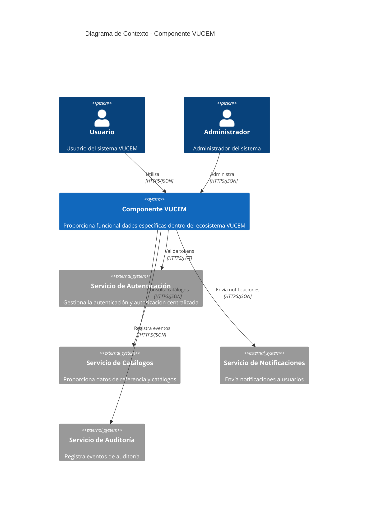
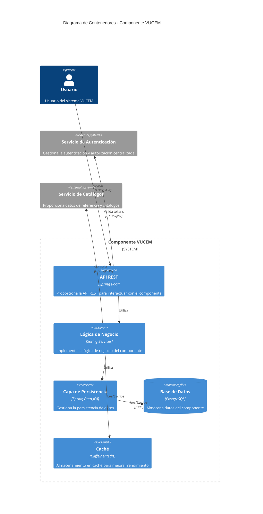
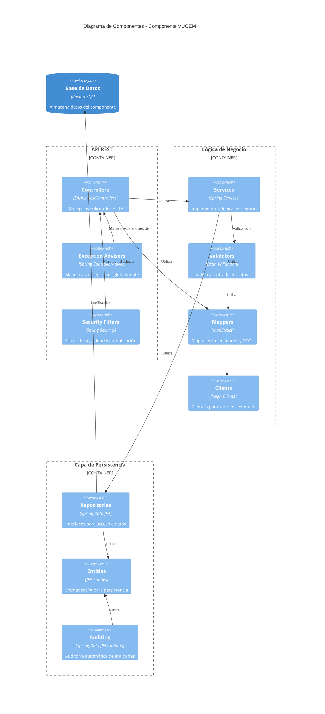
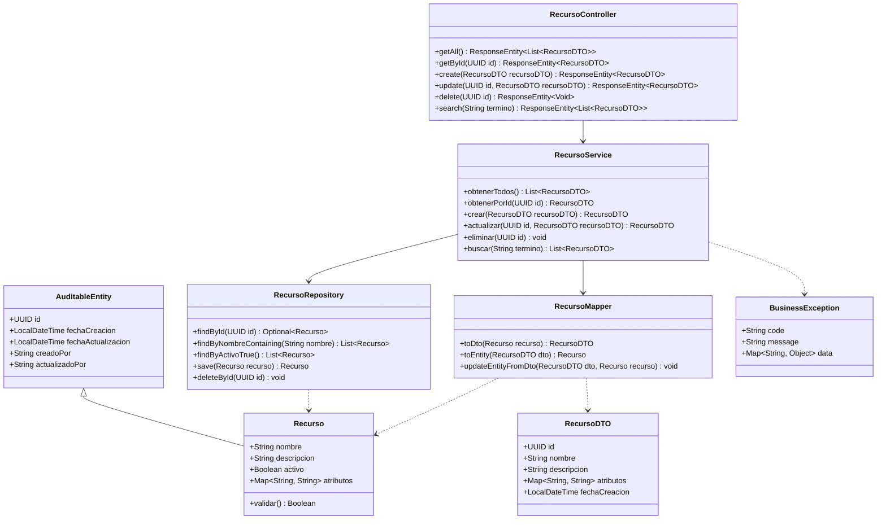
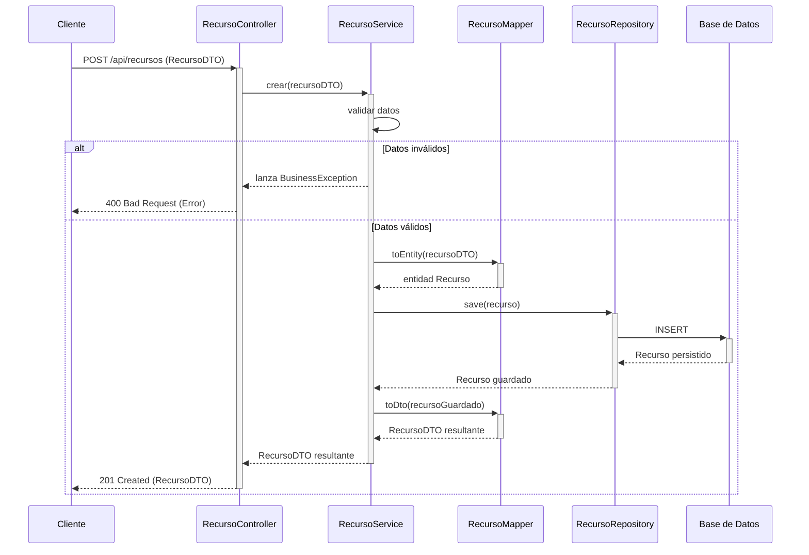
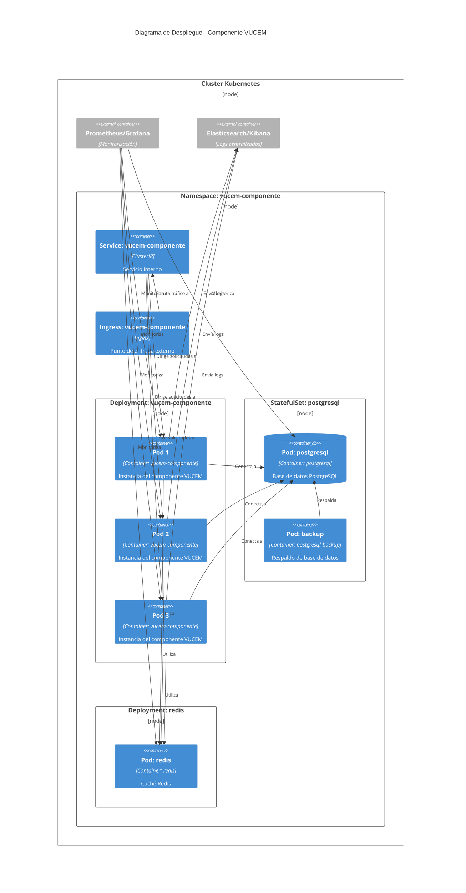
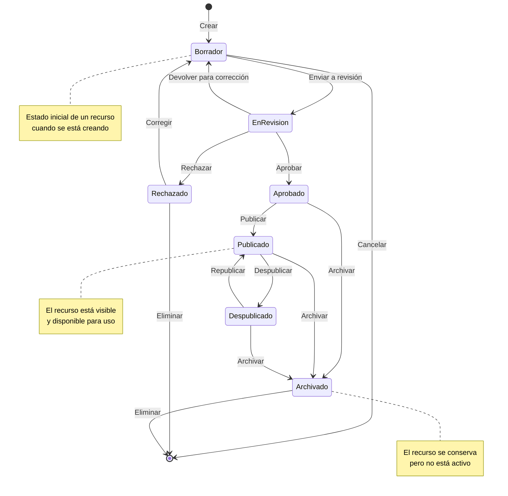

# Diagramas de Arquitectura del Componente VUCEM

## Índice

1. [Diagrama de Contexto](#diagrama-de-contexto)
2. [Diagrama de Contenedores](#diagrama-de-contenedores)
3. [Diagrama de Componentes](#diagrama-de-componentes)
4. [Diagrama de Clases](#diagrama-de-clases)
5. [Diagrama de Secuencia](#diagrama-de-secuencia)
6. [Diagrama de Despliegue](#diagrama-de-despliegue)
7. [Diagrama de Estado](#diagrama-de-estado)

## Diagrama de Contexto

El diagrama de contexto muestra cómo el componente VUCEM interactúa con los sistemas externos y usuarios.

## Diagrama de Contenedores

El diagrama de contenedores muestra cómo el componente VUCEM está compuesto internamente.

## Diagrama de Componentes

El diagrama de componentes muestra la estructura interna de los componentes software del sistema.

## Diagrama de Clases

El diagrama de clases muestra las principales clases del componente VUCEM y sus relaciones.

## Diagrama de Secuencia

El diagrama de secuencia muestra cómo interactúan los componentes en un flujo típico.

## Diagrama de Despliegue

El diagrama de despliegue muestra cómo se despliega el componente VUCEM en infraestructura.

## Diagrama de Estado

Este diagrama muestra los estados posibles de un recurso y las transiciones entre ellos.

