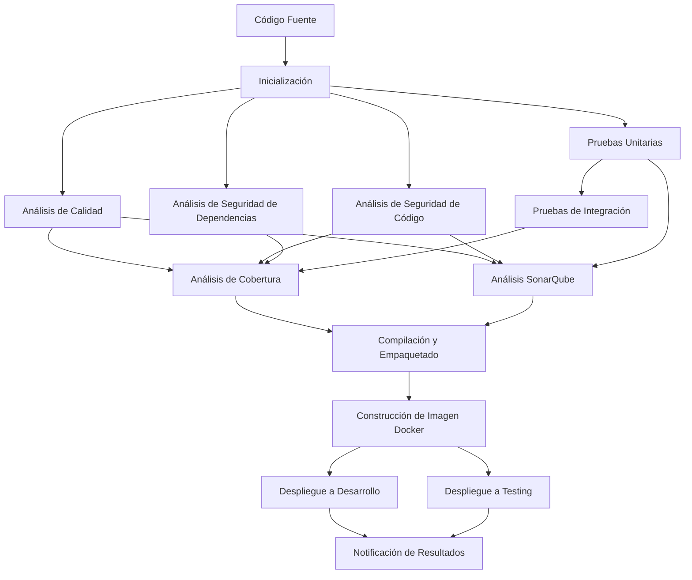
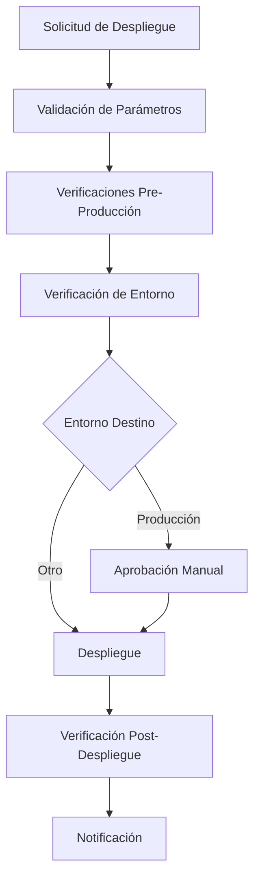
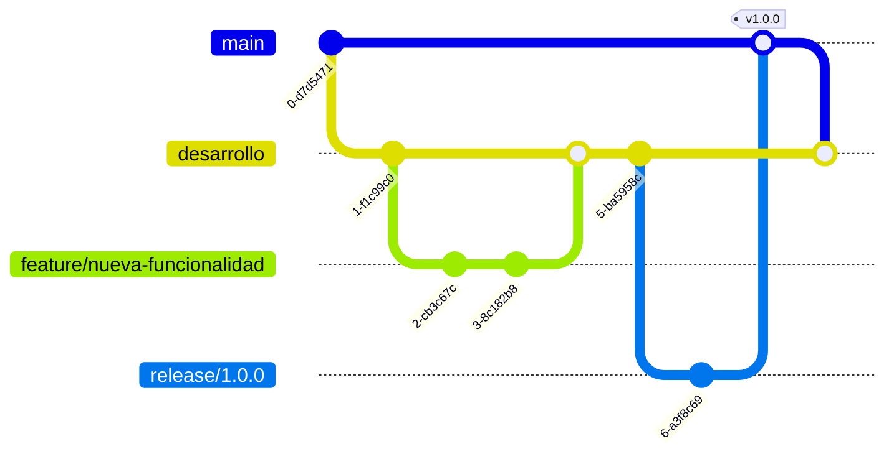

# Documento de Arquitectura de Pipeline CI/CD

## 1. Introducción

### 1.1 Propósito del Documento

Este documento describe la arquitectura, los componentes y el flujo de trabajo de los pipelines de Integración Continua (CI) y Entrega Continua (CD) implementados para el proyecto VUCEM. Está dirigido a desarrolladores, DevOps, administradores de sistemas y otros equipos técnicos involucrados en el desarrollo, despliegue y mantenimiento del sistema.

### 1.2 Alcance

Este documento cubre:
- Arquitectura modular de los pipelines CI/CD
- Descripción detallada de cada etapa del pipeline
- Herramientas y tecnologías utilizadas
- Prácticas y estándares de seguridad implementados
- Estrategias de implementación y despliegue

### 1.3 Definiciones y Acrónimos

- **CI**: Integración Continua
- **CD**: Entrega/Despliegue Continuo
- **DevSecOps**: Desarrollo, Seguridad y Operaciones
- **SCA**: Análisis de Composición de Software
- **SAST**: Análisis Estático de Seguridad de Aplicaciones
- **DAST**: Análisis Dinámico de Seguridad de Aplicaciones
- **SBOM**: Lista de Materiales de Software (Software Bill of Materials)
- **IaC**: Infraestructura como Código

## 2. Arquitectura General de CI/CD

### 2.1 Principios de Diseño

La arquitectura del pipeline sigue estos principios fundamentales:

1. **Modularidad**: Separación clara de etapas para facilitar mantenimiento y reutilización
2. **Composición**: Uso de acciones compuestas reutilizables para funcionalidades comunes
3. **Seguridad por Diseño**: Incorporación de análisis de seguridad en todas las etapas
4. **Observabilidad**: Generación de informes detallados para cada etapa
5. **Automatización**: Minimización de intervención manual en todo el proceso
6. **Idempotencia**: Mismos resultados independientemente de cuántas veces se ejecute
7. **Aislamiento**: Independencia entre etapas para evitar efectos colaterales
8. **Robustez**: Manejo adecuado de errores y timeout configurados para evitar bloqueos
9. **Estandarización**: Consistencia en nomenclatura y estructura a través de workflows

### 2.2 Visión General del Flujo CI/CD

### 2.3 Herramientas y Tecnologías

| Categoría | Herramientas |
|-----------|--------------|
| Plataforma CI/CD | GitHub Actions |
| Control de Versiones | Git, GitHub |
| Compilación | Maven |
| Análisis de Código | Checkstyle, PMD, SpotBugs, ArchUnit |
| Seguridad | CodeQL, OWASP Dependency Check, Trivy, Gitleaks, TruffleHog, ZAP |
| Pruebas | JUnit, Failsafe |
| Cobertura | JaCoCo |
| Calidad | SonarQube |
| Contenedores | Docker, Buildx, Cosign (firma), Dockle (verificación) |
| Orquestación | Kubernetes, Kustomize |
| Notificaciones | Sistema unificado de notificaciones, Slack, Teams |
| Cumplimiento | CycloneDX (SBOM), License Finder |

## 3. Etapas del Pipeline CI

### 3.1 Inicialización

**Propósito**: Configurar el entorno y definir parámetros para todo el pipeline.

**Actividades principales**:
- Obtención del código fuente
- Determinación de versión del artefacto según rama
- Generación de claves para caché
- Configuración de matriz de pruebas
- Determinación si se requiere despliegue

**Salidas**:
- Versión del artefacto
- Configuración de matriz de pruebas
- Indicador de despliegue
- Hash corto del commit
- Nombre normalizado de rama
- Clave de caché

### 3.2 Análisis de Calidad

**Propósito**: Verificar que el código cumple con los estándares de calidad establecidos.

**Actividades principales**:
- Configuración del entorno mediante la acción compuesta `setup-environment`
- Validación de estilo de código con Checkstyle
- Análisis estático con SpotBugs
- Análisis estático con PMD
- Validación de arquitectura con ArchUnit
- Uso de la acción compuesta `quality-checks` para una ejecución estandarizada

**Salidas**:
- Informe de calidad
- Errores/advertencias detectados
- Métricas estandarizadas de calidad

### 3.3 Análisis de Seguridad

#### 3.3.1 Análisis de Seguridad de Código

**Propósito**: Identificar vulnerabilidades de seguridad en el código.

**Actividades principales**:
- Configuración del entorno mediante la acción compuesta `setup-environment`
- Inicialización de CodeQL
- Compilación del código para análisis
- Ejecución de consultas de seguridad extendidas
- Análisis de resultados
- Análisis adicional mediante la acción compuesta `security-scan` con enfoque en código
- Escaneo de secretos con Gitleaks y TruffleHog
- Búsqueda de patrones de credenciales en archivos de configuración

**Salidas**:
- Informe de seguridad del código en formato SARIF
- Vulnerabilidades detectadas categorizadas por severidad
- Informe de posibles secretos expuestos
- Recomendaciones de mitigación

#### 3.3.2 Análisis de Seguridad de Dependencias

**Propósito**: Identificar vulnerabilidades en dependencias externas.

**Actividades principales**:
- Configuración del entorno mediante la acción compuesta `setup-environment`
- Escaneo mediante la acción compuesta `security-scan` con enfoque en dependencias
- Análisis profundo con OWASP Dependency Check
- Generación de SBOM (Software Bill of Materials) con CycloneDX
- Revisión de dependencias en PRs con políticas para licencias prohibidas
- Envío opcional a sistemas de seguimiento de vulnerabilidades (Dependency Track)

**Salidas**:
- Informe detallado de vulnerabilidades en dependencias
- Documento SBOM en formato CycloneDX (JSON)
- Políticas de licencias aplicadas y verificadas
- Informe de auditoría de dependencias

### 3.4 Pruebas

#### 3.4.1 Pruebas Unitarias

**Propósito**: Verificar el funcionamiento correcto de componentes individuales.

**Actividades principales**:
- Configuración del entorno mediante la acción compuesta `setup-environment`
- Ejecución de pruebas unitarias en matriz de entornos (múltiples combinaciones de OS/JDK/DB)
- Generación de informes de resultados con formato estandarizado
- Recolección de datos de cobertura mediante JaCoCo
- Publicación de informes mediante herramienta especializada para visualización

**Salidas**:
- Resultados detallados de pruebas unitarias por combinación de entorno
- Datos de cobertura de código estructurados por módulos
- Artefactos con informes de pruebas para análisis posterior
- Métricas de tiempo de ejecución por test

#### 3.4.2 Pruebas de Integración

**Propósito**: Verificar la correcta interacción entre componentes.

**Actividades principales**:
- Configuración del entorno mediante la acción compuesta `setup-environment`
- Aprovisionamiento de servicios auxiliares como base de datos PostgreSQL
- Configuración del entorno de pruebas con perfiles específicos
- Ejecución de pruebas de integración con el plugin Failsafe de Maven
- Generación de informes de resultados estructurados
- Publicación de informes en formato visual para análisis

**Salidas**:
- Resultados detallados de pruebas de integración
- Datos adicionales de cobertura en directorio específico
- Métricas de rendimiento de integraciones
- Capturas de comportamiento de servicios externos

### 3.5 Análisis de Cobertura

**Propósito**: Evaluar la completitud de las pruebas.

**Actividades principales**:
- Configuración del entorno mediante la acción compuesta `setup-environment`
- Descarga y procesamiento de artefactos de cobertura previos
- Fusión de informes de cobertura unitaria (H2, PostgreSQL) e integración
- Generación de informe consolidado con JaCoCo
- Verificación rigurosa de umbrales mínimos de cobertura configurables
- Publicación de informes visuales detallados
- Envío opcional de datos a plataformas como Codecov

**Salidas**:
- Informe consolidado de cobertura con desglose por módulo y clase
- Métricas detalladas de cobertura (instrucciones, ramas, líneas, métodos)
- Visualización interactiva de áreas con baja cobertura
- Tendencias de cobertura comparadas con ejecuciones previas

### 3.6 Análisis SonarQube

**Propósito**: Realizar un análisis integral de calidad del código.

**Actividades principales**:
- Configuración del entorno mediante la acción compuesta `setup-environment`
- Descarga y procesamiento de informes de cobertura
- Generación de informes JaCoCo en formato compatible con SonarQube
- Configuración dinámica específica según tipo de ejecución (PR o rama)
- Envío de datos a SonarQube o SonarCloud con parámetros adecuados
- Análisis de resultados con reglas personalizadas de calidad
- Configuración de timeout apropiado para evitar bloqueos

**Salidas**:
- Informe detallado de calidad en plataforma SonarQube/SonarCloud
- Métricas completas de código (complejidad, duplicación, cobertura, deuda técnica)
- Análisis de tendencias de calidad a lo largo del tiempo
- Recomendaciones específicas para mejorar la calidad del código

### 3.7 Compilación y Empaquetado

**Propósito**: Generar el artefacto ejecutable.

**Actividades principales**:
- Configuración del entorno mediante la acción compuesta `setup-environment`
- Compilación del código fuente con Maven
- Empaquetado en formato JAR con versión dinámica basada en rama
- Verificación rigurosa del artefacto generado (integridad, tamaño, contenido)
- Generación de metadatos para imagen Docker
- Etiquetado dinámico según rama de desarrollo
- Creación de SBOM detallado con CycloneDX
- Generación de informes de compilación estructurados

**Salidas**:
- Artefacto JAR ejecutable verificado
- Metadatos completos de imagen Docker
- SBOM detallado del artefacto en formato JSON
- Informe de compilación con métricas y metadatos
- Artefactos publicados con retención configurada

### 3.8 Construcción de Imagen Docker

**Propósito**: Crear la imagen contenedora para el despliegue.

**Actividades principales**:
- Descarga de artefactos de compilación 
- Configuración de Docker Buildx para optimización multi-plataforma
- Autenticación en registro de contenedores con credenciales seguras
- Construcción de imagen Docker con estrategia multi-etapa
- Etiquetado inteligente según rama (main, desarrollo, release) y versión
- Generación automática de SBOM integrado en la imagen
- Escaneo de vulnerabilidades mediante la acción compuesta `security-scan`
- Análisis completo con Trivy para verificación de vulnerabilidades
- Publicación de resultados en formato SARIF para seguimiento
- Firma opcional de imágenes con Cosign para garantía de cadena de suministro

**Salidas**:
- Imagen Docker publicada con etiquetas múltiples
- Informe detallado de vulnerabilidades categorizado por severidad
- Metadatos completos y etiquetas conforme a estándares OCI
- Provenance y SBOM integrados en la imagen
- Resultados de seguridad publicados para revisión

### 3.9 Despliegue

#### 3.9.1 Despliegue a Desarrollo

**Propósito**: Desplegar la aplicación en el entorno de desarrollo.

**Actividades principales**:
- Ejecución mediante la acción compuesta `deployment` con parámetros específicos
- Configuración segura de Kubernetes con credenciales adecuadamente protegidas
- Especificación de namespace, imagen y etiqueta para el entorno de desarrollo
- Selección de método de despliegue Kustomize para mayor flexibilidad
- Configuración de timeout para garantizar finalización adecuada
- Aplicación de manifiestos con los valores actualizados
- Verificación exhaustiva del estado del despliegue
- Comprobación del estado de pods, servicios e ingress

**Salidas**:
- Aplicación desplegada en entorno de desarrollo con configuración apropiada
- Informe detallado de estado del despliegue con pods en ejecución
- Validación de la disponibilidad de la aplicación
- Logs de despliegue para auditoría y diagnóstico

#### 3.9.2 Despliegue a Testing

**Propósito**: Desplegar la aplicación en el entorno de pruebas.

**Actividades principales**:
- Ejecución mediante la acción compuesta `deployment` con parámetros para entorno de pruebas
- Configuración segura de Kubernetes con credenciales específicas para entorno de testing
- Especificación de namespace, imagen y etiqueta con prefijo RC (Release Candidate)
- Selección de método de despliegue Kustomize con configuración específica para testing
- Configuración de timeout para garantizar finalización controlada
- Aplicación de manifiestos con los valores actualizados para entorno de pruebas
- Verificación exhaustiva del despliegue en ambiente controlado
- Validación completa de la aplicación desplegada (pods, servicios, ingress, configuraciones)

**Salidas**:
- Aplicación desplegada en entorno de pruebas con configuración adecuada
- Informe detallado de estado del despliegue con verificación de disponibilidad
- Validación completa de endpoints y réplicas desplegadas
- Logs de despliegue y eventos para auditoría y diagnóstico de problemas

### 3.10 Notificación

**Propósito**: Comunicar el resultado del pipeline a los interesados.

**Actividades principales**:
- Recopilación de estados de todas las etapas del pipeline
- Procesamiento de resultados para generar iconos visuales de estado
- Generación de informe final completo y estructurado
- Uso de la acción compuesta `notification` para envío estandarizado
- Configuración de notificación según tipo (éxito/fracaso)
- Inclusión de detalles específicos (versión, commit, estado de cada etapa)
- Adición de enlace directo al pipeline para consulta rápida
- Envío a canales configurados (Slack por defecto, Teams opcional)

**Salidas**:
- Informe final detallado del pipeline con métricas y resultados
- Notificación enviada en formato estandarizado
- Registro de notificación en logs para auditoría
- Artefacto con resumen publicado para referencia futura

## 4. Pipeline de Entrega Continua (CD)

### 4.1 Arquitectura del Pipeline CD

El pipeline CD es un flujo separado que se activa manualmente para desplegar versiones específicas en entornos productivos.

### 4.2 Etapas Principales del CD

1. **Validación de parámetros**: Verifica entorno, versión y configuración
2. **Verificaciones pre-producción**: Comprueba que la versión ha pasado pruebas previas
3. **Verificación de entorno**: Valida la configuración del entorno de destino
4. **Aprobación manual**: Para entornos críticos como producción
5. **Despliegue**: Actualización de la aplicación en el entorno destino
6. **Verificación post-despliegue**: Comprueba el estado después del despliegue
7. **Notificación**: Comunica el resultado del despliegue

## 5. Implementación de Seguridad (DevSecOps)

### 5.1 Análisis de Seguridad por Etapas

| Etapa | Implementaciones de Seguridad |
|-------|-------------------------------|
| Análisis de Código | CodeQL con reglas extendidas, enfoque en patrones de seguridad |
| Dependencias | Escaneo de vulnerabilidades, verificación de licencias, SBOM |
| Compilación | Auditoría de proceso, firma de artefactos |
| Imagen Docker | Escaneo con Trivy, imágenes base mínimas, least privilege |
| Despliegue | Verificación de integridad, secrets management |

### 5.2 Gestión de Secretos

- Uso de variables de entorno protegidas en GitHub Actions
- Ámbitos limitados para los tokens de servicio
- Separación por entornos (desarrollo, pruebas, producción)
- Servicio de identidad para autenticación en Kubernetes

### 5.3 Gestión de Permisos

- Segregación de responsabilidades entre pipelines
- Permisos mínimos necesarios para cada job
- Requerimiento de aprobación para despliegues productivos
- Auditoría de todas las acciones realizadas

## 6. Estrategias de Despliegue

### 6.1 Flujo de Trabajo de Ramas

### 6.2 Estrategias por Entorno

| Entorno | Estrategia | Origen | Validación |
|---------|------------|--------|------------|
| Desarrollo | Rolling update | Rama `desarrollo` y `feature/*` | Automática |
| Testing | Blue/Green | Rama `release/*` | Automática |
| QA | Blue/Green | Tag específico | Manual |
| Producción | Canary | Tag estable | Manual con múltiples aprobaciones |

### 6.3 Rollback y Recuperación

- Estrategia de rollback automatizada para fallos en despliegue
- Retención de versiones anteriores para recuperación rápida
- Monitoreo post-despliegue con alertas automáticas
- Procedimientos documentados para rollback manual en caso necesario

## 7. Observabilidad y Monitoreo

### 7.1 Artefactos Generados

Cada ejecución del pipeline genera los siguientes artefactos:

- Informes de calidad y análisis estático
- Resultados de pruebas unitarias e integración
- Informes de cobertura de código
- Reportes de vulnerabilidades
- SBOM completo
- Manifiestos de despliegue aplicados
- Informes de estado post-despliegue

### 7.2 Métricas del Pipeline

- Tiempo total de ejecución
- Tiempo por etapa
- Tasa de éxito/fallo
- Tendencias de calidad y seguridad
- Métricas de cobertura por módulo

### 7.3 Notificaciones y Alertas

- Notificaciones de Slack para completitud del pipeline
- Alertas por vulnerabilidades críticas
- Informes periódicos de salud del pipeline
- Integración con sistemas de tickets para seguimiento

## 8. Mejores Prácticas Implementadas

### 8.1 Optimización de Rendimiento

- Caché de dependencias basado en hash de POM
- Paralelización de etapas independientes
- Estrategia de matriz para pruebas concurrentes
- Reutilización de resultados intermedios

### 8.2 Mantenibilidad

- Estructura modular con clara separación de responsabilidades
- Nombres descriptivos para jobs y pasos
- Documentación integrada en el código del workflow
- Estructuras de datos estandarizadas entre etapas

### 8.3 Sostenibilidad

- Limpieza automática de artefactos temporales
- Políticas de retención para artefactos de larga duración
- Optimización de recursos de computación
- Acciones idempotentes y repetibles

## 9. Apéndices

### 9.1 Referencias

- [GitHub Actions Documentation](https://docs.github.com/es/actions)
- [Maven Build Lifecycle](https://maven.apache.org/guides/introduction/introduction-to-the-lifecycle.html)
- [Docker Buildx](https://docs.docker.com/buildx/working-with-buildx/)
- [Kustomize Documentation](https://kubectl.docs.kubernetes.io/references/kustomize/)
- [OWASP Top 10](https://owasp.org/www-project-top-ten/)
- [CycloneDX SBOM Standard](https://cyclonedx.org/)

### 9.2 Historial de Revisiones

| Fecha | Versión | Descripción | Autor        |
|-------|---------|-------------|--------------|
| 2025-03-19 | 1.0 | Versión inicial | Oscar Valois |